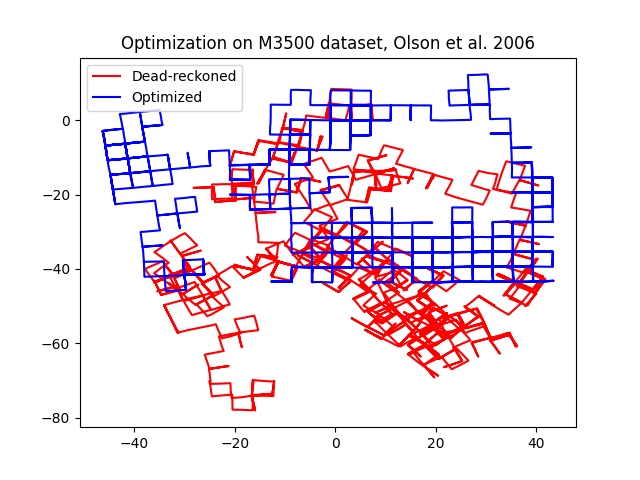
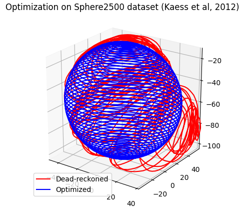

# jaxfg

Library for solving factor graph-based least squares problems with JAX. Heavily
influenced by [minisam](https://github.com/dongjing3309/minisam),
[GTSAM](https://gtsam.org/), and [g2o](https://github.com/RainerKuemmerle/g2o).

Applications include sensor fusion, optimal control, planning, SLAM, etc.

---

### Example scripts:

`scripts/m3500_g2o.py`:

`scripts/sphere2500_g2o.py`:

---

### To-do

- [x] Preliminary graph, variable, factor interfaces
- [x] Real vector variable types
- [x] Refactor into package
- [x] Linear factor graph
- [x] Non-linear factor graph
  - [x] Very basic Gauss-Newton implementation
  - [x] Termination criteria
  - [x] Damped least squares
  - [x] Inexact Newton steps
  - [x] Revisit termination criteria
  - [ ] Reduce redundant code
- [x] MAP inference
- [x] Compare g2o example
  - [x] Validate against minisam
- [x] Performance
  - [x] More intentional JIT compilation
  - [x] Re-implement parallel factor computation
  - [x] Vectorized linearization
  - [x] Basic (Jacobi) CGLS preconditioning
- [x] Manifold optimization (mostly offloaded to
      [jaxlie](https://github.com/brentyi/jaxlie))
  - [x] Basic interface
  - [x] Manifold optimization on SO2
  - [x] Manifold optimization on SE2
  - [x] Manifold optimization on SO3
  - [x] Manifold optimization on SE3
- [ ] Usability + code health (low priority)
  - [x] Basic cleanup/refactor
    - [x] Better parallel factor interface
    - [x] Separate out utils, lie group helpers
    - [x] Put things in folders
  - [x] Resolve typing errors
  - [ ] Cleanup/refactor (more)
  - [ ] Package cleanup: dependencies, etc
  - [ ] Add CI:
    - [x] mypy
    - [x] lint
    - [ ] build
  - [ ] Tests
